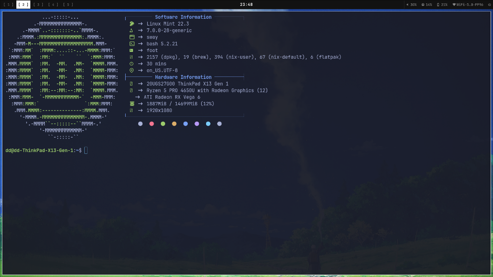
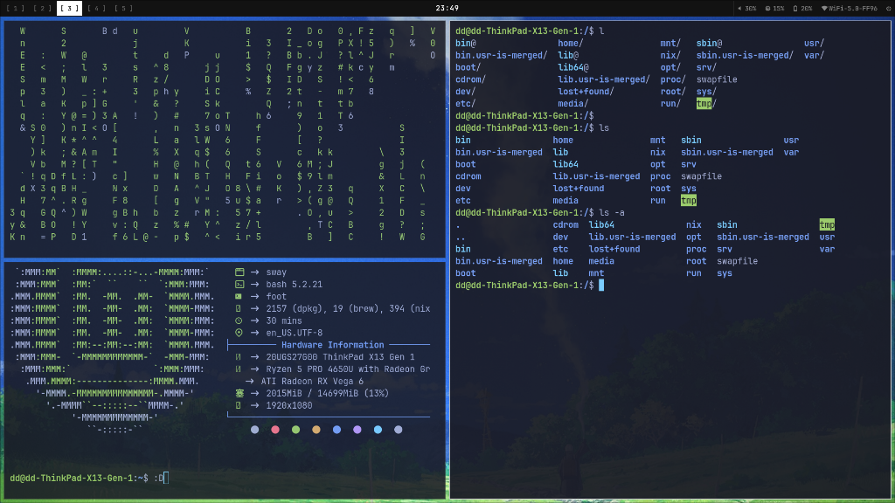
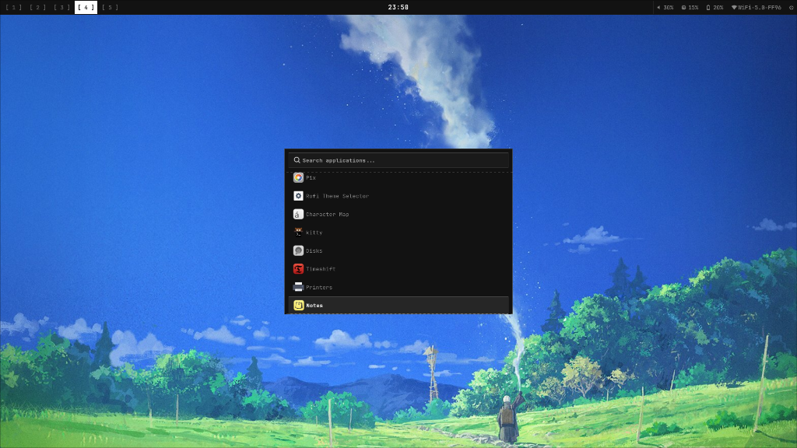
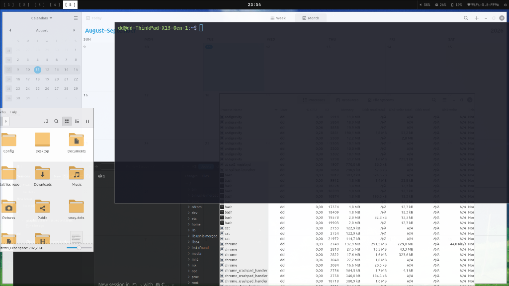

<div align="center">

```
██╗  ██╗██╗   ██╗██████╗ ██████╗     ██████╗  ██████╗ ████████╗███████╗
██║  ██║╚██╗ ██╔╝██╔══██╗██╔══██╗    ██╔══██╗██╔═══██╗╚══██╔══╝██╔════╝
███████║ ╚████╔╝ ██████╔╝██████╔╝    ██║  ██║██║   ██║   ██║   ███████╗
██╔══██║  ╚██╔╝  ██╔═══╝ ██╔══██╗    ██║  ██║██║   ██║   ██║   ╚════██║
██║  ██║   ██║   ██║     ██║  ██║    ██████╔╝╚██████╔╝   ██║   ███████║
╚═╝  ╚═╝   ╚═╝   ╚═╝     ╚═╝  ╚═╝    ╚═════╝  ╚═════╝    ╚═╝   ╚══════╝
```

### `minimalist · vintage · retro`


</div>

---

## 📸 Screenshots

<div align="center">

### ✦ Terminal & System Fetch


### ✦ Tiling Window Layout


### ✦ Wofi Application Launcher


### ✦ Multi-Window Workspace


</div>

---

## ✦ Stack

| Component | Tool |
|-----------|------|
| 🪟 **Window Manager** | [Hyprland](https://hyprland.org) 0.56 |
| 📊 **Status Bar** | [Waybar](https://github.com/Alexays/Waybar) |
| 💻 **Terminal** | [Foot](https://codeberg.org/dnkl/foot) |
| 🚀 **Launcher** | [Wofi](https://hg.sr.ht/~scoopta/wofi) |
| 🖼️ **Wallpaper** | [swaybg](https://github.com/swaywm/swaybg) |
| 🔔 **Notifications** | [Mako](https://github.com/emersion/mako) |
| 🔒 **Lock Screen** | [Swaylock](https://github.com/swaywm/swaylock) |
| 🎨 **Font** | JetBrainsMono Nerd Font |
| 🎨 **Terminal Theme** | Tokyo Night |

---

## ✦ Features

```
◆  Dual monitor — Independent workspaces per screen
◆  120Hz external monitor support (Philips 27")
◆  Auto power switching — Performance on AC, Power-Saver on battery
◆  Vintage monochrome palette — #121212 / #cccccc / 1px sharp borders
◆  Sleep/wake freeze fix for AMD GPU ThinkPads
◆  Neofetch on every terminal open
◆  One-line install & update script
```

---

## ✦ Keybindings

```
SUPER + Enter         Open terminal
SUPER + Space         App launcher
SUPER + C             Close window
SUPER + F             Fullscreen
SUPER + V             Float window
SUPER + L             Lock screen
SUPER + M             Exit Hyprland
SUPER + Tab           Switch monitor focus
SUPER + 1–5           Workspaces (laptop)
SUPER + 6–10          Workspaces (external monitor)
SUPER + Shift + 1–10  Move window to workspace
SUPER + Arrow Keys    Move focus
SUPER + Shift + S     Screenshot region to clipboard
Print                 Screenshot (save to ~/Pictures)
```

---

## ✦ Install

```bash
curl -sSL https://raw.githubusercontent.com/gothssmy-design/hyprland-dotfiles/main/install.sh | bash
```

> ✓ Backs up your existing configs automatically before installing.

### Update to latest version

```bash
curl -sSL https://raw.githubusercontent.com/gothssmy-design/hyprland-dotfiles/main/install.sh | bash
```

---

## ✦ Dependencies

```bash
sudo apt install hyprland waybar foot wofi mako swaybg swaylock \
                 grim slurp wl-clipboard brightnessctl \
                 pipewire wireplumber fonts-jetbrains-mono
```

---

## ✦ Structure

```
.config/
├── hypr/
│   ├── hyprland.conf       Main config
│   ├── hyprlock.conf       Lock screen
│   ├── hyprpaper.conf      Wallpaper
│   ├── fix-socket.sh       Waybar IPC fix
│   ├── power-daemon.sh     Auto power switcher
│   └── toggle-wofi.sh      Launcher toggle
├── waybar/
│   ├── config              Dual monitor bar
│   └── style.css           Vintage monochrome styles
├── foot/
│   └── foot.ini            Tokyo Night terminal theme
├── wofi/
│   └── style.css           Launcher styles
└── mako/
    └── config              Notification styles
```

---

<div align="center">

`made with ♥ on a ThinkPad X13`

</div>
